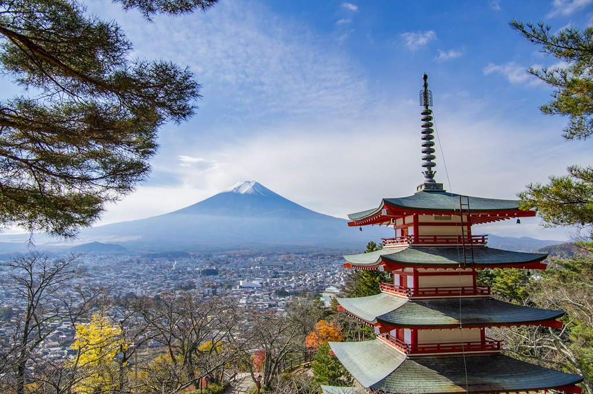
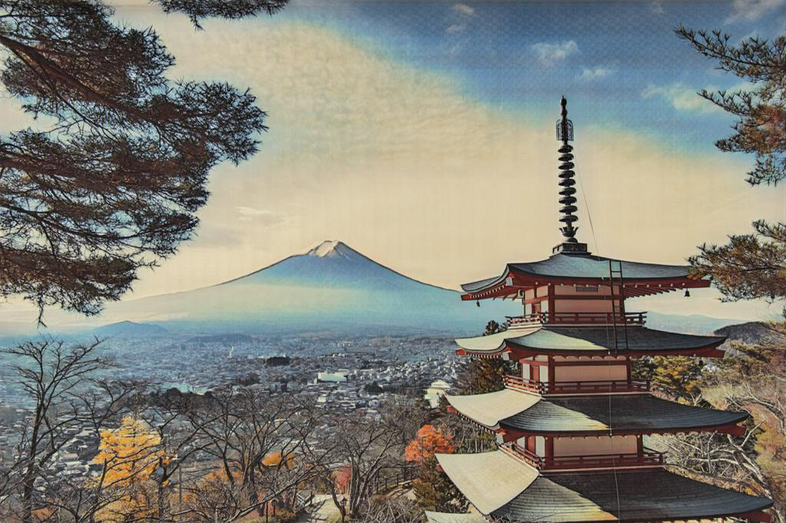
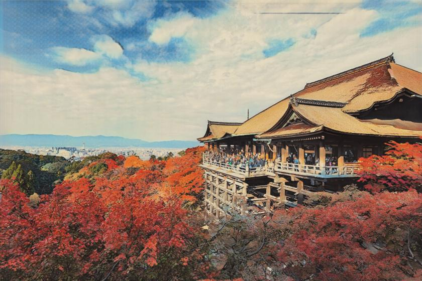

# Ukiyoe Style Transfer API

CycleGANを用いて、風景画像を浮世絵風に変換する画像変換アプリです。
ユーザーが画像をアップロードすると、学習済みモデルによって浮世絵風画像へ変換されます。

---

## Overview

このプロジェクトでは、写真画像と浮世絵画像を用いてCycleGANを学習し、
実写画像を日本の伝統的な浮世絵風へ変換するモデルを構築しました。

FastAPIで推論APIを作成し、Streamlitでフロントエンドを構築しています。

---

## Features

* 画像アップロード機能
* CycleGANによるスタイル変換
* 双方向変換対応

  * Photo → Ukiyoe
  * Ukiyoe → Photo
* 変換画像の保存
* 変換画像のダウンロード

---

## Tech Stack

* Python
* TensorFlow / Keras
* CycleGAN
* FastAPI
* Streamlit
* Pillow
* NumPy

---

## Project Structure

```text
ukiyoe-api/
├── app/
│   └── main.py
├── models/
│   ├── generator_g_200.h5
│   └── generator_f_200.h5
├── outputs/
├── sample_images/
│   ├── input_1.jpg
│   ├── output_1.jpg
│   ├── input_2.jpg
│   ├── output_2.jpg
├── streamlit_app.py
├── requirements.txt
├── README.md
└── .gitignore
```

---

## Sample Results

| Input | Output |
|---|---|
|  |  |
|  |  |

---

## Installation

```bash
git clone https://github.com/yourname/ukiyoe-api.git
cd ukiyoe-api
python -m venv myenv
source myenv/bin/activate
pip install -r requirements.txt
```

---

## Run FastAPI

```bash
uvicorn app.main:app --reload
```

Server:

```text
http://127.0.0.1:8000
```

---

## Run Streamlit

```bash
streamlit run streamlit_app.py
```

App:

```text
http://localhost:8501
```

---

## API Endpoint

### POST /predict

Upload an image and select a model type.

Parameters:

* file: image file
* model:

  * g2z (photo → ukiyoe)
  * z2g (ukiyoe → photo)

---

## Model

CycleGAN generators:

* generator_g_200.h5
* generator_f_200.h5

Input size:

* 1024 × 1024

Output:

* RGB image

---

## Model files

学習済みモデルは容量の都合上リポジトリに含めていません。  
以下のファイルを `models/` に配置してください。

- generator_g_200.h5
- generator_f_200.h5

---

## 今後の改善予定

- 軽量デプロイのためのTFLite変換
- メモリ使用量最適化のための量子化
- Webアプリとしての公開（Render / Streamlit Cloud）
- 浮世絵以外の日本美術スタイルへの拡張

---

